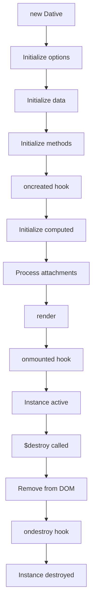

## Overview

Lifecycle hooks allow you to run code at specific stages of a Dative instance's lifecycle. DativeJS provides three main lifecycle hooks:

1. `oncreated` - Called when instance is created but before mounting
2. `onmounted` - Called after instance is mounted to the DOM
3. `ondestroy` - Called when instance is destroyed

## Lifecycle Flow



## oncreated

Called immediately after the instance is created, before mounting to the DOM.

```javascript
new Dative({
  oncreated() {
    // Instance is created
  }
})
```

### Timing

The `oncreated` hook is called after:
- Options are initialized
- Data is made reactive
- Methods are bound to instance

But before:
- Computed properties are initialized
- Template is rendered
- Instance is mounted to DOM

### Available Context

Within `oncreated`, you have access to:

<ParamField path="this.data" type="object">
  The reactive data object
</ParamField>

<ParamField path="this.methods" type="object">
  Instance methods (accessible as `this.methodName()`)
</ParamField>

<ParamField path="this.options" type="DativeOptions">
  The full options object
</ParamField>

<ParamField path="this._uid" type="number">
  Unique instance identifier
</ParamField>

### Not Yet Available

<Warning>
  These are NOT available in `oncreated`:
  - `this.$el` - Not mounted yet
  - `this.$ref` - Refs not processed yet
  - `this.computed` properties - Not initialized yet
  - DOM elements - Not rendered yet
</Warning>

### Usage

```javascript
const app = new Dative({
  el: '#app',
  
  data() {
    return {
      user: null,
      loading: true
    }
  },
  
  oncreated() {
    console.log('Instance created with UID:', this._uid)
    
    // Good: Initialize data
    this.loading = true
    
    // Good: Fetch data
    this.fetchUserData()
    
    // Good: Set up non-DOM state
    this.startTime = Date.now()
    
    // Bad: Access DOM (not mounted yet)
    // this.$el.classList.add('active') // Error!
  },
  
  methods: {
    async fetchUserData() {
      const response = await fetch('/api/user')
      this.user = await response.json()
      this.loading = false
    }
  }
})
```

### Use Cases

- Initialize data before mounting
- Fetch initial data from APIs
- Set up timers or intervals
- Register global event listeners
- Initialize third-party libraries (non-DOM)
- Log instance creation

## onmounted

Called after the instance is mounted to the DOM and the initial render is complete.

```javascript
new Dative({
  onmounted() {
    // Instance is mounted and rendered
  }
})
```

### Timing

The `onmounted` hook is called after:
- Instance is created
- Template is parsed and rendered
- Instance is mounted to DOM element
- Directives are processed
- Event listeners are attached
- Refs are available

### Available Context

Within `onmounted`, you have access to everything:

<ParamField path="this.$el" type="Element">
  The mounted DOM element
</ParamField>

<ParamField path="this.$ref" type="object">
  All template refs
</ParamField>

<ParamField path="this.data" type="object">
  Reactive data
</ParamField>

<ParamField path="this.methods" type="object">
  Instance methods
</ParamField>

<ParamField path="this.computed" type="any">
  Computed properties
</ParamField>

<ParamField path="this.isMounted" type="boolean">
  Always `true` in this hook
</ParamField>

### Usage

```javascript
const app = new Dative({
  el: '#app',
  
  data() {
    return {
      count: 0
    }
  },
  
  template: `
    <div>
      <h1 ref="title">Count: {{ count }}</h1>
      <input ref="input" type="text">
    </div>
  `,
  
  onmounted() {
    console.log('Mounted to:', this.$el)
    
    // Good: Access DOM elements
    this.$el.classList.add('mounted')
    
    // Good: Access refs
    this.$ref.input.focus()
    this.$ref.title.style.color = 'blue'
    
    // Good: Manipulate DOM
    const rect = this.$el.getBoundingClientRect()
    console.log('Element dimensions:', rect)
    
    // Good: Initialize DOM-dependent libraries
    this.chart = new Chart(this.$ref.canvas, {
      type: 'bar',
      data: this.chartData
    })
    
    // Good: Set up resize observers
    this.resizeObserver = new ResizeObserver(entries => {
      this.handleResize(entries[0])
    })
    this.resizeObserver.observe(this.$el)
  }
})
```

### Use Cases

- Access and manipulate DOM elements
- Focus input fields
- Initialize DOM-dependent libraries (charts, maps, etc.)
- Measure element dimensions
- Set up DOM observers (Intersection, Resize, Mutation)
- Trigger animations
- Scroll to elements
- Apply dynamic styles based on calculations

## ondestroy

Called when the instance is destroyed via `$destroy()`.

```javascript
new Dative({
  ondestroy() {
    // Cleanup before destruction
  }
})
```

### Timing

The `ondestroy` hook is called:
- After `$destroy()` is called
- After the element is removed from DOM
- After internal cleanup is performed
- Before instance becomes completely unusable

### Available Context

<ParamField path="this.data" type="object">
  Data is still accessible
</ParamField>

<ParamField path="this.$el" type="Element">
  Element reference (but removed from DOM)
</ParamField>

<ParamField path="this.isUnmounted" type="boolean">
  Always `true` in this hook
</ParamField>

<ParamField path="this.isMounted" type="boolean">
  Always `false` in this hook
</ParamField>

### Usage

```javascript
const app = new Dative({
  el: '#app',
  
  data() {
    return {
      interval: null,
      subscription: null,
      observer: null
    }
  },
  
  onmounted() {
    // Set up resources that need cleanup
    this.interval = setInterval(() => {
      console.log('Tick')
    }, 1000)
    
    this.subscription = eventBus.subscribe('update', this.handleUpdate)
    
    this.observer = new IntersectionObserver(entries => {
      // Handle intersection
    })
    this.observer.observe(this.$el)
  },
  
  ondestroy() {
    console.log('Cleaning up instance')
    
    // Good: Clear timers
    if (this.interval) {
      clearInterval(this.interval)
      this.interval = null
    }
    
    // Good: Unsubscribe from events
    if (this.subscription) {
      this.subscription.unsubscribe()
      this.subscription = null
    }
    
    // Good: Disconnect observers
    if (this.observer) {
      this.observer.disconnect()
      this.observer = null
    }
    
    // Good: Remove global event listeners
    window.removeEventListener('resize', this.handleResize)
    
    // Good: Destroy third-party library instances
    if (this.chart) {
      this.chart.destroy()
      this.chart = null
    }
    
    console.log('Cleanup complete')
  },
  
  methods: {
    handleUpdate(data) {
      this.set('data', data)
    },
    
    handleResize() {
      // Handle resize
    }
  }
})

// Later, destroy the instance
app.$destroy()
// Console: 'Cleaning up instance'
// Console: 'Cleanup complete'
```

### Use Cases

- Clear timers and intervals
- Unsubscribe from event listeners
- Disconnect observers (Intersection, Resize, Mutation)
- Remove global event handlers
- Destroy third-party library instances
- Close WebSocket connections
- Cancel pending requests
- Save state to localStorage
- Log analytics events
- Perform final cleanup

## Complete Lifecycle Example

```javascript
import Dative from 'dativejs'

const Dashboard = Dative.extend({
  data() {
    return {
      stats: null,
      loading: false,
      updateInterval: null,
      chart: null
    }
  },
  
  template: `
    <div class="dashboard">
      <h1 ref="title">Dashboard</h1>
      <div ref="loading" class="{{ loading ? 'visible' : 'hidden' }}">
        Loading...
      </div>
      <canvas ref="chart"></canvas>
      <div>{{ stats }}</div>
    </div>
  `,
  
  oncreated() {
    console.log('Dashboard instance created')
    
    // Fetch initial data
    this.loading = true
    this.fetchStats()
  },
  
  onmounted() {
    console.log('Dashboard mounted to DOM')
    
    // Initialize chart with DOM element
    this.chart = new Chart(this.$ref.chart, {
      type: 'line',
      data: this.stats
    })
    
    // Start auto-refresh
    this.updateInterval = setInterval(() => {
      this.fetchStats()
    }, 30000) // Every 30 seconds
    
    // Add resize handler
    window.addEventListener('resize', this.handleResize)
    
    // Focus title for accessibility
    this.$ref.title.focus()
  },
  
  ondestroy() {
    console.log('Dashboard being destroyed')
    
    // Stop auto-refresh
    if (this.updateInterval) {
      clearInterval(this.updateInterval)
    }
    
    // Remove resize handler
    window.removeEventListener('resize', this.handleResize)
    
    // Destroy chart
    if (this.chart) {
      this.chart.destroy()
    }
    
    console.log('Dashboard cleanup complete')
  },
  
  methods: {
    async fetchStats() {
      this.loading = true
      try {
        const response = await fetch('/api/stats')
        this.stats = await response.json()
        
        // Update chart if it exists
        if (this.chart) {
          this.chart.data = this.stats
          this.chart.update()
        }
      } catch (error) {
        console.error('Failed to fetch stats:', error)
      } finally {
        this.loading = false
      }
    },
    
    handleResize() {
      if (this.chart) {
        this.chart.resize()
      }
    }
  }
})

// Create instance
const dashboard = new Dashboard({ el: '#app' })
// Console: 'Dashboard instance created'
// Console: 'Dashboard mounted to DOM'

// Later, when done
dashboard.$destroy()
// Console: 'Dashboard being destroyed'
// Console: 'Dashboard cleanup complete'
```

## Best Practices

### Do's

✅ Use `oncreated` for:
- Non-DOM initialization
- Data fetching
- Setting up reactive state

✅ Use `onmounted` for:
- DOM manipulation
- Accessing refs
- Initializing DOM-dependent libraries
- Setting up observers

✅ Use `ondestroy` for:
- Cleaning up timers
- Removing event listeners
- Destroying library instances
- Preventing memory leaks

### Don'ts

❌ Don't access DOM in `oncreated`:
```javascript
oncreated() {
  this.$el.classList.add('ready') // Error! Not mounted yet
}
```

❌ Don't forget to clean up:
```javascript
onmounted() {
  setInterval(() => { /* ... */ }, 1000)
  // Missing ondestroy cleanup = memory leak!
}
```

❌ Don't perform heavy operations in hooks:
```javascript
onmounted() {
  // Bad: Blocks rendering
  for (let i = 0; i < 1000000; i++) {
    // Heavy computation
  }
}
```

Instead, use async or defer:
```javascript
onmounted() {
  // Good: Non-blocking
  setTimeout(() => {
    // Heavy computation
  }, 0)
}
```