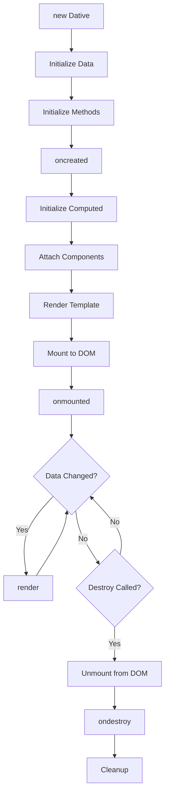

## Overview

DativeJS components go through a lifecycle from creation to destruction. Lifecycle hooks allow you to run code at specific stages of a component's life.

## Lifecycle Stages

<Steps>
  <Step title="Creation">
    Component instance is created and data is initialized
    
    **Hook:** `oncreated`
  </Step>
  
  <Step title="Mounting">
    Component is rendered and mounted to the DOM
    
    **Hook:** `onmounted`
  </Step>
  
  <Step title="Updates">
    Component re-renders when reactive data changes
    
    **Method:** `render()`
  </Step>
  
  <Step title="Destruction">
    Component is unmounted and cleaned up
    
    **Hook:** `ondestroy`
  </Step>
</Steps>

## Lifecycle Hooks

### oncreated

Called when the component instance is created, before mounting to the DOM.

```javascript index.js:1256-1279
function _init($this) {
  $this.oncreated = $this.options.oncreated || config.noop;
  $this.onmounted = $this.options.onmounted || config.noop;
  $this.methods = $this.options.methods || Object.create(null);
  $this.directives = $this.options.directives || Object.create(null);
  $this.animate = $this.options.animate || Object.create(null);
  $this.$ref = Object.create(null);
  $this.isUnmounted = false;
  $this.isMounted = false;
  $this.ondestroy = $this.options.ondestroy || config.noop;
  $this.attached = [];
  $this.sanitize =
    $this.options.sanitize === undefined ? false : $this.options.sanitize;
  if ($this.options.css) $this.cssId_ = uuid_();
  initData($this.options, $this);
  initMethods($this);
  // ...
  if ($this.oncreated !== undefined && $this.oncreated !== null) {
    $this.oncreated();
  }
  $this._uid = $$uid += 1;
  // ...
}
```

<Tabs>
  <Tab title="Basic Usage">
    ```javascript
    const app = new Dative({
      el: '#app',
      data() {
        return {
          users: [],
          loading: true
        }
      },
      oncreated() {
        console.log('Component created!');
        console.log('Data:', this.users);
        // this.$el is NOT available yet
      },
      template: `<div>{{ users.length }} users</div>`
    });
    ```
  </Tab>
  
  <Tab title="Fetch Data">
    ```javascript
    const app = new Dative({
      el: '#app',
      data() {
        return {
          posts: [],
          error: null
        }
      },
      async oncreated() {
        try {
          const response = await fetch('/api/posts');
          this.posts = await response.json();
        } catch (err) {
          this.error = err.message;
        }
      },
      template: `
        <div>
          #if error
            <p>Error: {{ error }}</p>
          :else
            #each posts as post
              <article>{{ post.title }}</article>
            /each
          /if
        </div>
      `
    });
    ```
  </Tab>
  
  <Tab title="Initialize Services">
    ```javascript
    const app = new Dative({
      el: '#app',
      data() {
        return {
          websocket: null,
          messages: []
        }
      },
      oncreated() {
        // Initialize WebSocket connection
        this.websocket = new WebSocket('ws://localhost:8080');
        
        this.websocket.onmessage = (event) => {
          this.messages.push(JSON.parse(event.data));
          this.render();
        };
      },
      template: `
        <div>
          #each messages as msg
            <p>{{ msg.text }}</p>
          /each
        </div>
      `
    });
    ```
  </Tab>
</Tabs>

<Note>
  **Available in oncreated:**
  - `this.data` - Reactive data
  - `this.methods` - Component methods
  - Computed properties
  
  **NOT available:**
  - `this.$el` - DOM element (not mounted yet)
  - `this.$ref` - Element references (not rendered yet)
</Note>

### onmounted

Called after the component is rendered and mounted to the DOM.

```javascript index.js:1302-1310
if ($this.onmounted !== undefined && $this.onmounted !== null) {
    $this.onmounted();
} else if (
  $this.isUnmounted &&
  $this.ondestroy !== null &&
  $this.ondestroy !== undefined
) {
  $this.ondestroy();
}
```

<Tabs>
  <Tab title="DOM Access">
    ```javascript
    const app = new Dative({
      el: '#app',
      data() {
        return {
          message: 'Hello'
        }
      },
      onmounted() {
        console.log('Component mounted!');
        console.log('Element:', this.$el);
        console.log('Element height:', this.$el.offsetHeight);
        
        // Safe to access refs
        this.$ref.input.focus();
      },
      template: `
        <div>
          <input ref="input" />
          <p>{{ message }}</p>
        </div>
      `
    });
    ```
  </Tab>
  
  <Tab title="Third-party Libraries">
    ```javascript
    const app = new Dative({
      el: '#app',
      data() {
        return {
          chartData: [10, 20, 30, 40, 50]
        }
      },
      onmounted() {
        // Initialize Chart.js after mounting
        const ctx = this.$ref.canvas.getContext('2d');
        this.chart = new Chart(ctx, {
          type: 'bar',
          data: {
            labels: ['A', 'B', 'C', 'D', 'E'],
            datasets: [{
              label: 'Data',
              data: this.chartData
            }]
          }
        });
      },
      template: `
        <div>
          <canvas ref="canvas"></canvas>
        </div>
      `
    });
    ```
  </Tab>
  
  <Tab title="Event Listeners">
    ```javascript
    const app = new Dative({
      el: '#app',
      data() {
        return {
          scrollY: 0
        }
      },
      onmounted() {
        // Add global event listeners
        this.handleScroll = () => {
          this.scrollY = window.scrollY;
          this.render();
        };
        
        window.addEventListener('scroll', this.handleScroll);
        
        // Setup intersection observer
        this.observer = new IntersectionObserver((entries) => {
          entries.forEach(entry => {
            if (entry.isIntersecting) {
              console.log('Element is visible!');
            }
          });
        });
        
        this.observer.observe(this.$el);
      },
      template: `<div>Scroll position: {{ scrollY }}</div>`
    });
    ```
  </Tab>
</Tabs>

<Note>
  **Available in onmounted:**
  - `this.$el` - Mounted DOM element
  - `this.$ref` - All element references
  - All data and methods
  - Component is fully initialized
</Note>

### ondestroy

Called when the component is destroyed and unmounted from the DOM.

```javascript index.js:1401-1416
Dative.prototype.$destroy = function () {
  var $this = this;
  if ($this.isUnmounted) {
    warn("Instance can't be unmounted again");
  }
  if ($this.isMounted) {
    this.$el.firstChild.remove();
    delete this.onmounted;
    delete this.$el.dative_app;
    $this.isUnmounted = true;
    $this.isMounted = false;
    $this.ondestroy();
  } else {
    warn("Cannot use $destroy() on an instance that's not mounted");
  }
};
```

<Tabs>
  <Tab title="Cleanup">
    ```javascript
    const app = new Dative({
      el: '#app',
      data() {
        return {
          intervalId: null,
          count: 0
        }
      },
      onmounted() {
        // Start interval
        this.intervalId = setInterval(() => {
          this.count++;
          this.render();
        }, 1000);
      },
      ondestroy() {
        // Clean up interval
        if (this.intervalId) {
          clearInterval(this.intervalId);
          console.log('Interval cleared');
        }
      },
      template: `<div>Count: {{ count }}</div>`
    });
    
    // Later...
    app.$destroy();
    ```
  </Tab>
  
  <Tab title="Remove Listeners">
    ```javascript
    const app = new Dative({
      el: '#app',
      data() {
        return {
          position: { x: 0, y: 0 }
        }
      },
      onmounted() {
        this.handleMouseMove = (e) => {
          this.position = { x: e.clientX, y: e.clientY };
          this.render();
        };
        
        window.addEventListener('mousemove', this.handleMouseMove);
      },
      ondestroy() {
        // Remove event listener
        window.removeEventListener('mousemove', this.handleMouseMove);
        console.log('Event listeners removed');
      },
      template: `<div>X: {{ position.x }}, Y: {{ position.y }}</div>`
    });
    ```
  </Tab>
  
  <Tab title="Close Connections">
    ```javascript
    const app = new Dative({
      el: '#app',
      data() {
        return {
          websocket: null,
          connected: false
        }
      },
      oncreated() {
        this.websocket = new WebSocket('ws://localhost:8080');
        this.websocket.onopen = () => {
          this.connected = true;
          this.render();
        };
      },
      ondestroy() {
        // Close WebSocket connection
        if (this.websocket) {
          this.websocket.close();
          console.log('WebSocket connection closed');
        }
        
        // Save state to localStorage
        localStorage.setItem('lastState', JSON.stringify(this.data));
      },
      template: `
        <div>
          {{ connected ? 'Connected' : 'Disconnected' }}
        </div>
      `
    });
    ```
  </Tab>
</Tabs>

<Warning>
  Always clean up in `ondestroy` to prevent memory leaks:
  - Clear timers (intervals, timeouts)
  - Remove event listeners
  - Close connections (WebSocket, SSE, etc.)
  - Cancel pending requests
  - Destroy third-party library instances
</Warning>

## Lifecycle Flow



## Execution Order Example

```javascript
const app = new Dative({
  el: '#app',
  data() {
    console.log('1. data() called');
    return { count: 0 }
  },
  oncreated() {
    console.log('2. oncreated hook');
    console.log('   - Data available:', this.count);
    console.log('   - $el available:', !!this.$el);  // false
  },
  onmounted() {
    console.log('3. onmounted hook');
    console.log('   - Data available:', this.count);
    console.log('   - $el available:', !!this.$el);  // true
    console.log('   - Element:', this.$el.tagName);
  },
  methods: {
    increment() {
      this.count++;
      console.log('4. Data changed, render() called');
    }
  },
  ondestroy() {
    console.log('5. ondestroy hook');
    console.log('   - Final count:', this.count);
  },
  template: `
    <div>
      <p>Count: {{ count }}</p>
      <button on:click="increment()">+</button>
    </div>
  `
});

// Later...
app.$destroy();
```

**Console Output:**
```
1. data() called
2. oncreated hook
   - Data available: 0
   - $el available: false
3. onmounted hook
   - Data available: 0
   - $el available: true
   - Element: DIV
// User clicks button
4. Data changed, render() called
// User destroys component
5. ondestroy hook
   - Final count: 1
```

## Component State Properties

<ResponseField name="isMounted" type="boolean">
  Indicates whether the component is currently mounted to the DOM
  
  ```javascript
  onmounted() {
    console.log(this.isMounted);  // true
  }
  ```
</ResponseField>

<ResponseField name="isUnmounted" type="boolean">
  Indicates whether the component has been destroyed
  
  ```javascript
  ondestroy() {
    console.log(this.isUnmounted);  // true
  }
  ```
</ResponseField>

<ResponseField name="_uid" type="number">
  Unique identifier for the component instance
  
  ```javascript
  oncreated() {
    console.log('Component ID:', this._uid);
  }
  ```
</ResponseField>

## Manual Rendering

You can manually trigger a re-render using the `render()` method:

```javascript index.js:842-1093
Dative.prototype.render = function () {
  var $app = this;
  $app.kebabToCamel = kebabToCamel;
  let template =
    type(this.options.template) === "function"
      ? this.options.template()
      : this.options.template || "";
  if (typeof template === "string") {
    if (template[0] === "#") {
      template = idToTemplate(template);
    }
  }
  this.template = template;
  $app.isMounted = true;
  $app.isUnmounted = false;
  // ... rendering logic
  return elem;
};
```

```javascript
const app = new Dative({
  el: '#app',
  data() {
    return {
      count: 0
    }
  },
  methods: {
    incrementSilently() {
      // Update data without automatic re-render
      this.data.count++;
    },
    incrementAndRender() {
      // Update and manually trigger render
      this.data.count++;
      this.render();
    }
  }
});
```

<Note>
  Most of the time you don't need to call `render()` manually, as DativeJS automatically re-renders when reactive data changes via proxies.
</Note>

## Best Practices

<AccordionGroup>
  <Accordion title="Use oncreated for data fetching">
    Fetch initial data in `oncreated` so it starts loading before the component mounts.
    
    ```javascript
    async oncreated() {
      this.loading = true;
      this.users = await fetchUsers();
      this.loading = false;
    }
    ```
  </Accordion>
  
  <Accordion title="Use onmounted for DOM manipulation">
    Access DOM elements and initialize third-party libraries in `onmounted` when the DOM is ready.
    
    ```javascript
    onmounted() {
      this.chart = new Chart(this.$ref.canvas, config);
    }
    ```
  </Accordion>
  
  <Accordion title="Always clean up in ondestroy">
    Prevent memory leaks by cleaning up resources in `ondestroy`.
    
    ```javascript
    ondestroy() {
      clearInterval(this.intervalId);
      window.removeEventListener('resize', this.handleResize);
      this.websocket?.close();
    }
    ```
  </Accordion>
  
  <Accordion title="Avoid heavy operations in lifecycle hooks">
    Keep lifecycle hooks fast. Move heavy operations to async methods or web workers.
    
    ```javascript
    // Good
    async oncreated() {
      this.loadData();  // Non-blocking
    },
    methods: {
      async loadData() {
        // Heavy operation
      }
    }
    
    // Bad
    oncreated() {
      // Blocks component initialization
      const result = expensiveSync Calculation();
    }
    ```
  </Accordion>
</AccordionGroup>

## Common Patterns

### Loading State Pattern

```javascript
const app = new Dative({
  el: '#app',
  data() {
    return {
      loading: false,
      data: null,
      error: null
    }
  },
  async oncreated() {
    await this.fetchData();
  },
  methods: {
    async fetchData() {
      this.loading = true;
      this.error = null;
      
      try {
        const response = await fetch('/api/data');
        this.data = await response.json();
      } catch (err) {
        this.error = err.message;
      } finally {
        this.loading = false;
        this.render();
      }
    }
  },
  template: `
    <div>
      #if loading
        <p>Loading...</p>
      :else if error
        <p>Error: {{ error }}</p>
      :else
        <pre>{{ JSON.stringify(data, null, 2) }}</pre>
      /if
    </div>
  `
});
```

### Subscription Pattern

```javascript
const app = new Dative({
  el: '#app',
  data() {
    return {
      messages: []
    }
  },
  oncreated() {
    this.eventSource = new EventSource('/api/events');
  },
  onmounted() {
    this.eventSource.onmessage = (event) => {
      this.messages.push(JSON.parse(event.data));
      this.render();
    };
  },
  ondestroy() {
    this.eventSource.close();
  },
  template: `
    <div>
      #each messages as msg
        <p>{{ msg.text }}</p>
      /each
    </div>
  `
});
```

## Related

<CardGroup cols={3}>
  <Card title="Reactivity" icon="arrows-rotate" href="/core/reactivity">
    Reactive data system
  </Card>
  <Card title="Components" icon="cube" href="/core/components">
    Component creation
  </Card>
  <Card title="Templating" icon="code" href="/core/templating">
    Template syntax
  </Card>
</CardGroup>